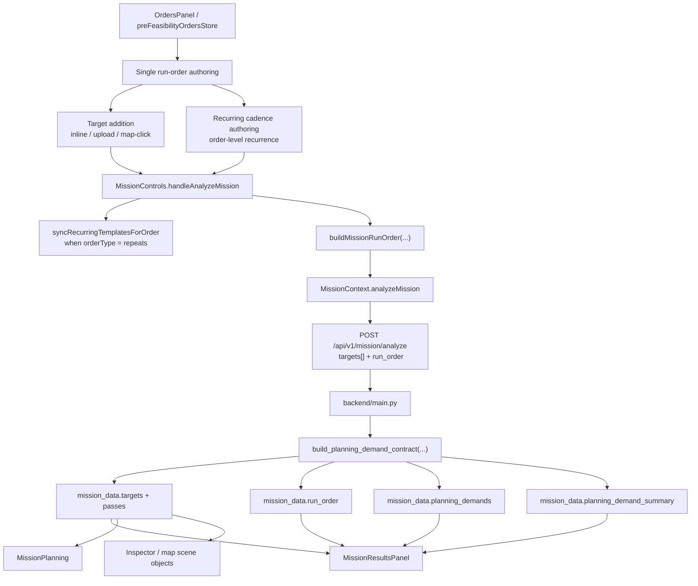

# Audit: Feasibility Results Minimal Evolution

## Executive verdict

- The current authoring and API path already supports the new architecture well enough:
  - one run
  - one run-level order
  - recurring cadence on that order
  - additive demand-aware feasibility response fields
- The current rendered UI does **not** consume that demand-aware response yet.
- `Feasibility Results` is still primarily a **target/pass** UI:
  - counts are target-based
  - grouping is target-based
  - timeline lanes are target-based
  - inspector target details are target-based
- The smallest good next step is **not** a deep redesign.
- The smallest good next step is a **light grouping upgrade** inside the existing `MissionResultsPanel`:
  - keep the current layout shell
  - add a compact demand-aware summary/list grouped by day
  - keep the current target timeline as a secondary aggregate view
- Do **not** do the dual-view redesign in the next PR.
- Separate but important follow-up: `MissionPlanning.tsx` still uses a hidden `now -> now+7d` planning context, which diverges from Mission Parameters and the time ownership rules.

## Files inspected

### Frontend

- `frontend/src/components/MissionControls.tsx`
- `frontend/src/components/MissionPlanning.tsx`
- `frontend/src/components/MissionResultsPanel.tsx`
- `frontend/src/components/OrdersPanel.tsx`
- `frontend/src/components/ScheduleTimeline.tsx`
- `frontend/src/components/ObjectExplorer/Inspector.tsx`
- `frontend/src/components/Map/GlobeViewport.tsx`
- `frontend/src/context/MissionContext.tsx`
- `frontend/src/store/preFeasibilityOrdersStore.ts`
- `frontend/src/store/selectionStore.ts`
- `frontend/src/utils/planningDemand.ts`
- `frontend/src/types/index.ts`
- `frontend/src/api/mission.ts`
- `frontend/src/api/schemas/index.ts`

### Backend / contract

- `backend/main.py`
- `backend/planning_demands.py`
- `backend/schemas/mission.py`

### Docs / prior audit context

- `docs/architecture/PLANNING_TIME_OWNERSHIP.md`
- `docs/architecture/SINGLE_ORDER_PER_RUN.md`
- `docs/architecture/PLANNING_DEMAND_CONTRACT.md`
- `docs/audits/AUDIT_RECURRING_AWARE_PLANNING_AND_FEASIBILITY.md`
- `docs/PR_SCHED_007_CHECKLIST.md`
- `docs/PR_SCHED_009_CHECKLIST.md`

## Current flow map

### Current end-to-end behavior

| Step | Current behavior | Reuse vs change |
| --- | --- | --- |
| Single run-order authoring | `preFeasibilityOrdersStore` enforces exactly one order. `createOrder()` returns the existing order if one already exists. | Reuse as-is |
| Target addition | Targets are added into that single order by inline entry, file upload, or map click. | Reuse as-is |
| Recurring template authoring | `OrdersPanel` authors recurrence once at order level, and hydrates backend templates back into one merged order. | Reuse as-is |
| Analyze request | `MissionControls` builds one flattened `targets[]` array plus additive `run_order` metadata. | Reuse as-is |
| Planning-demand response | Backend returns `run_order`, `planning_demands`, and `planning_demand_summary` in `mission_data`. | Reuse as-is |
| Results rendering | `MissionResultsPanel` still renders from `missionData.targets` and `missionData.passes`. | Must change lightly |
| Selection / inspector / map linkage | Target selection is unified enough; feasibility opportunity selection is not unified enough. | Partial reuse |

### Where the UI still assumes the old model

- `MissionResultsPanel` assumes:
  - flattened targets are the primary result unit
  - target coverage is the main success metric
  - one merged lane per target is sufficient
- `MissionPlanning` assumes:
  - target statistics are the main summary metric
  - planned schedule rows are keyed by `target_id`, not by demand identity
- `Inspector` assumes:
  - selected target details should be derived from `missionData.targets` and `missionData.passes`
- `MissionContext` scene object hydration assumes:
  - target scene objects come directly from flattened `missionData.targets`
- Runtime component search shows no current frontend renderer for:
  - `mission_data.run_order`
  - `mission_data.planning_demands`
  - `mission_data.planning_demand_summary`

## Surface-by-surface audit

| Surface | Today operates on | Break / confusion once recurring demands appear | Can it be reused? | Minimum note |
| --- | --- | --- | --- | --- |
| `OrdersPanel` left authoring panel | Order + target | Low. The single-order-per-run model is already correct. | Yes | Keep the current authoring model. |
| `MissionControls` analyze handoff | Order + flattened targets + mission horizon | Low. Contract handoff is already aligned. | Yes | Keep request building unchanged. |
| `MissionResultsPanel` header summary | Mission horizon + target count + acquisition window | High. `X/Y targets` can say "1/1 targets" even when several dated recurring demands are uncovered. | Partial | Keep layout, change primary counters and copy. |
| `MissionResultsPanel` target pills | Target | Medium to high. Good as a filter, wrong as the primary recurring status surface. | Yes, secondary only | Keep as timeline filters, not as the main demand status UI. |
| `MissionResultsPanel` timeline lanes | Target + pass | High if treated as the main recurring-aware result. Distinct dated instances collapse into one lane. | Yes, aggregate only | Keep and relabel as `Master Timeline` or equivalent. |
| `MissionResultsPanel` tooltip + click | Pass only | Medium. Useful for map/time navigation, but it does not express which demand is being answered. | Yes | Keep pass tooltip behavior for aggregate timeline. |
| Standalone opportunities panel | None in the current shipped panel | N/A. There is no separate current opportunities list in Feasibility Results. | N/A | The new demand list can fill this role without redesigning the panel shell. |
| Right details pane (`Inspector`) target view | Target + pass count | High if expected to explain recurring coverage. It can only explain generic target observability today. | Partial | Leave unchanged in the next minimal PR. |
| `Inspector` selected opportunity details | Planning schedule opportunity | Medium. This is schedule/planning-oriented, not feasibility-demand-oriented. | Partial | Leave unchanged for now. |
| Map target click -> inspector | Target | Low. Still valid because canonical targets remain map identities. | Yes | Keep as-is. |
| Map swath / optical-pass click | Feasibility opportunity-like object, but via swath / vis stores | High. This path is not unified with the selection store that drives the inspector. | No, not in this PR | Track separately as a selection unification follow-up. |
| `MissionPlanning` opportunities table | Scheduled opportunity / target | Medium. Not a Feasibility Results surface, but still target-first. | Partial | Do not change in the next minimal Feasibility Results PR. |

## What already works

### Reuse exactly as-is

- Single-order-per-run authoring in `preFeasibilityOrdersStore`
- Order-level recurrence authoring in `OrdersPanel`
- Recurring template sync and hydration flow
- `buildMissionRunOrder(...)` and `toMissionAnalyzeRunOrder(...)`
- Backend materialization of recurring demands inside the analyzed horizon
- Additive response contract in `mission_data`
- Current target timeline rendering as an aggregate geometry view
- Canonical target map identity and target click -> inspector behavior

### Works, but only as a secondary aggregate model

- Target coverage badge
- Target filter pills
- Per-target opportunity lanes
- Target-level inspector statistics

These remain useful, but they are no longer enough as the primary recurring-aware result model.

## Data already available vs missing

### Already available from backend and preserved by frontend

| Data | Available now? | Notes |
| --- | --- | --- |
| `mission_data.run_order.id` / `name` / `order_type` | Yes | Enough to label the current run order in the UI |
| `mission_data.run_order.target_count` | Yes | Useful as a secondary metric |
| `mission_data.run_order.planning_demand_count` | Yes | Useful as a primary recurring-aware metric |
| `mission_data.run_order.recurrence.*` | Yes | Contains cadence, weekdays, local window, timezone, and validity dates |
| `mission_data.planning_demands[].demand_type` | Yes | Distinguishes one-time vs recurring instance |
| `mission_data.planning_demands[].display_target_name` | Yes | Safe operator-facing target label |
| `mission_data.planning_demands[].local_date` | Yes | Enough to group recurring demands by day |
| `mission_data.planning_demands[].requested_window_start/end` | Yes | Enough to show each demand's effective requested window |
| `mission_data.planning_demands[].matching_pass_count` | Yes | Enough for summary chips / row status |
| `mission_data.planning_demands[].matching_pass_indexes` | Yes | Enough to jump from a demand row to related pass bars |
| `mission_data.planning_demands[].best_pass_index` | Yes | Enough for one-click focus behavior |
| `mission_data.planning_demand_summary.*` | Yes | Enough for top-line counts without new backend work |
| `mission_data.passes[]` | Yes | Still useful as the aggregate / geometry timeline source |

### Important conclusion

The backend contract is already sufficient for the **next minimal UI PR**.

The next PR does **not** need:

- scheduler changes
- DB changes
- new response fields
- a new API endpoint

### Still missing for a clean recurring-aware results experience

| Missing piece | Why it matters | Needed in next minimal PR? |
| --- | --- | --- |
| Demand-aware view-model helpers in frontend | Needed to group and sort `planning_demands` by day and row status | Yes |
| Runtime UI consumers of `run_order` / `planning_demands` / `planning_demand_summary` | Today those fields are preserved but not rendered | Yes |
| Demand-aware selection identity | Needed for a future demand inspector and map highlighting model | No |
| Unified feasibility opportunity selection -> inspector path | Today map swath selection does not flow through the same selection model as the inspector | No |
| First-class one-time requested-window authoring | Today one-time timing effectively collapses to the run horizon | No |
| Demand-aware schedule / repair / reshuffle UX | Bigger follow-on normalization work | No |

## Time ownership consistency check

| Time concept | Source of truth per architecture | Current implementation | Verdict |
| --- | --- | --- | --- |
| Planning Horizon | Mission Parameters | `MissionControls` / `MissionParameters` own `startTime` and `endTime`, and `MissionContext` sends them to analyze. | Correct |
| Recurring local window | Orders / templates | `OrdersPanel` authors recurrence frequency and local from/to window at order level. | Correct |
| Recurring effective validity | Orders / templates | `OrdersPanel` authors `Active from` / `Active to` at order level. | Correct, but copy can still be sharpened |
| Global run filter | Mission Parameters | `acquisition_time_window` is authored in Mission Parameters and shown in Results. | Correct concept, but label is too generic |
| One-time requested window | Orders | Not first-class today. One-time demand timing effectively inherits the full run horizon. | Gap, but outside this minimal results PR |
| Feasibility displayed range | Results UI only | `MissionResultsPanel` computes `minTs/maxTs` from visible passes and stores local `viewRange`. | Correct behavior, but implicitly display-only |
| Schedule displayed range | Schedule UI only | `ScheduleTimeline` maintains local `viewRange`; mission start/end seed the axis. | Correct behavior |
| Planning mode-selection horizon | Mission Parameters should eventually govern planning scope too | `MissionPlanning.tsx` currently derives `now -> now+7d` for schedule context. | Inconsistent; separate follow-up required |

### Specific duplication / confusion risks

- `MissionResultsPanel` shows `Time window active` without clarifying that this is the **global acquisition filter**, not the recurring local demand window.
- `OrdersPanel` recurrence copy says active dates default from the current horizon. That is acceptable as initialization behavior, but the copy can blur ownership if treated as a live coupling.
- `MissionPlanning.tsx` introduces a hidden second horizon for planning context, which conflicts with the explicit ownership rule in `PLANNING_TIME_OWNERSHIP.md`.

## Minimum UI delta recommendation

### Option comparison

| Direction | What it means | Verdict |
| --- | --- | --- |
| Do almost nothing | Keep current target-centric results and only add a few badges | Too small. It leaves the primary recurring problem unsolved. |
| Light grouping upgrade | Keep the current panel shell, add demand grouping by day, and keep the current timeline as aggregate | **Recommended** |
| Dual-view redesign | Add explicit `Demand View` + `Master Timeline` modes | Correct long-term direction, but too large for the next PR |

### Recommended smallest good next step

Keep the current `MissionResultsPanel` layout, but make it recurring-aware in one narrow way:

1. Add a compact **Demand Summary** block above the current timeline.
2. Group rows by `local_date` when recurring demands exist.
3. Show one row per planning demand:
   - target label
   - one-time vs recurring-instance badge
   - requested window
   - feasible / no opportunity status
   - matching pass count
4. Clicking a row should jump to `best_pass_index`, or fall back to the first matching pass.
5. Keep the existing per-target pass timeline directly below it.
6. Relabel that timeline as an aggregate view:
   - `Master Timeline`
   - or `Target Timeline`
7. Keep target pills, but clearly treat them as timeline filters only.

That is the minimum change that:

- uses the new backend contract
- makes recurring dated gaps visible
- avoids a deep redesign
- avoids touching scheduler behavior

## What must change next

- Primary Feasibility Results counters must become demand-aware when planning-demand data is present.
- The panel must render `run_order` and `planning_demand_summary` somewhere operator-visible.
- The panel needs a small grouped demand list that answers:
  - which dated demands exist
  - which are feasible
  - which are uncovered
- The acquisition-window chip copy should clarify that it is a **global** filter, not order timing.
- The current timeline section should be renamed so operators understand it is the aggregate view, not the primary recurring status model.

## What can stay exactly as-is

- Orders authoring UX
- Single-order store shape
- Target add flows
- Template sync behavior
- Analyze request contract
- Backend demand materialization
- Current target timeline rendering mechanics
- Current map target selection behavior

## Deferred items

Do **not** change these yet:

- No dual-view tab architecture
- No inspector redesign around planning-demand identity
- No schedule / repair / reshuffle normalization in this PR
- No backend contract changes
- No scheduler changes
- No DB changes
- No exposure of raw `demand_id`, `instance_key`, or `template_id` as primary operator labels
- No attempt to solve the hidden `now -> now+7d` planning horizon issue inside the same UI PR

## Next implementation PR recommendation

### Recommended PR shape

- Frontend-only
- No backend changes
- No schema changes
- No redesign of surrounding sidebars

### Recommended files

- `frontend/src/components/MissionResultsPanel.tsx`
- `frontend/src/utils/planningDemand.ts` or a new small demand-view helper file
- `frontend/src/components/__tests__/MissionResultsPanel.test.tsx`

### Recommended implementation steps

1. Read `run_order`, `planning_demands`, and `planning_demand_summary` from `state.missionData`.
2. Build a tiny grouped demand view-model in the frontend:
   - sort by `local_date`
   - then by `requested_window_start`
   - then by `display_target_name`
3. Replace the primary `X/Y targets` badge with demand-aware counts when demand data is present.
4. Add a compact grouped demand list above the timeline.
5. Keep the current target timeline underneath and rename it as an aggregate view.
6. Keep target pills, but scope them explicitly to the aggregate timeline.
7. Rename the acquisition-window chip copy to clarify it is a global filter.
8. Add focused tests for:
   - one-time demand summary
   - recurring grouped rows by day
   - demand-row click navigation
   - aggregate timeline still working

### Final recommendation

The best next move is:

- **not** a redesign
- **not** a scheduler change
- **not** a new contract

It is a **small, frontend-only, demand-aware summary layer** added to the existing results panel, while preserving the current target timeline as the aggregate view.
